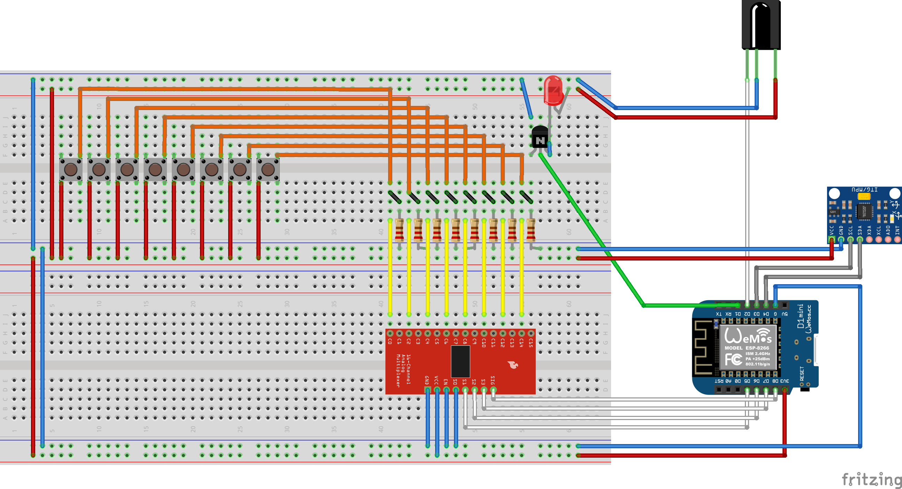

# ESP TV Remote
Un telecomando TV che, oltre alle funzionalità base, aggiunge:
- Un timer di spegnimento TV
- Un sistema di macro per ripetere azioni fatte da un altro telecomando infrarossi
- Traccia dati sull'utilizzo del telecomando e li manda via MQTT ad un server locale
- Comandi attivati con il movimento

## Video
[Funzioni Base (accendi/spegni, cambia canale ed alza/abbassa volume)](https://www.youtube.com/watch?v=fA1kTcw5104)  
[Registrazione e prova di una macro](https://youtu.be/JduhtKOBIow)  
[Logging pulsanti via MQTT](https://youtu.be/hkHsn6ePBMc)  

## Per adattare
Nel file `Config.h` si possono cambiare i pin usati, le info del wifi ed il broker mqtt a cui connettersi.  

## Librerie usate
* [EspMQTTClient](https://github.com/plapointe6/EspMQTTClient)
* [IRremoteESP8266](https://github.com/crankyoldgit/IRremoteESP8266)
* [MPU6050](https://github.com/electroniccats/mpu6050)

## Circuito

**Nota**: 
- Il led è un led IR, non un comune LED  
- Come ricevitore IR ho usato un VS1838B, che non è quello che si vede nel circuito (fritzing non ha quel pezzo)
